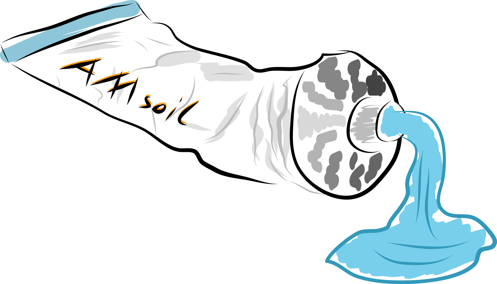

# Obsolete and Deprecated

This package is obsolete and deprecated as of May 1, 2016.
It is no longer maintained.

The [GENI Clearinghouse](https://github.com/GENI-NSF/geni-ch) no longer
uses or depends on this package as of
[version 2.11](https://github.com/GENI-NSF/geni-ch/releases/tag/v2.11).

# History

geni-soil was originally available as AMsoil at
https://github.com/fp7-ofelia/AMsoil.git. That repository was removed
due to copyright issues with AMS Oil (http://www.amsoil.com). A
descendent of that original repository is available at
https://github.com/EICT/eiSoil but that repository has a new commit
history.

This repository is a descendent of the original AMsoil repository. It
has been customized for the
[GENI Clearinghouse](https://github.com/GENI-NSF/geni-ch) in a few
small ways.

The original README file contained the [Purpose](#purpose),
[Documentation](#documentation), and
[Logo](#logo) sections which are reproduced in their entirety below.

# Branches

The original work on AMsoil was done on the "development"
branch. This branch has been renamed to "ofelia" to avoid confusion
with the "develop" branch.

Development of geni-soil follows Vincent Driessen's
[git branching model](http://nvie.com/posts/a-successful-git-branching-model/).
If you plan to contribute to this repository please branch off the
"develop" branch, which is the default branch. The "master" branch is
reserved for releases.

# Purpose

AMsoil is a light-weight framework for creating Aggregate Managers (AM) for test beds.
AMsoil is a pluggable system. It gives structure to develop new AMs and provides helpers for common tasks in AM development.

AMsoil is part of the [OFELIA](http://www.fp7-ofelia.eu/) [Control Framework (OCF)](https://github.com/fp7-ofelia).

If you don't know what an Aggregate Manager is please see [here](https://alpha.fp7-ofelia.eu/doc/index.php/General_terminology).

# Documentation

Before you do anything else, please checkout the [Quickstart](https://raw.github.com/fp7-ofelia/AMsoil/development/doc/AMsoil%20Quickstart.pdf)
Please see the [Wiki](https://github.com/fp7-ofelia/AMsoil/wiki) for more information.

# Logo

